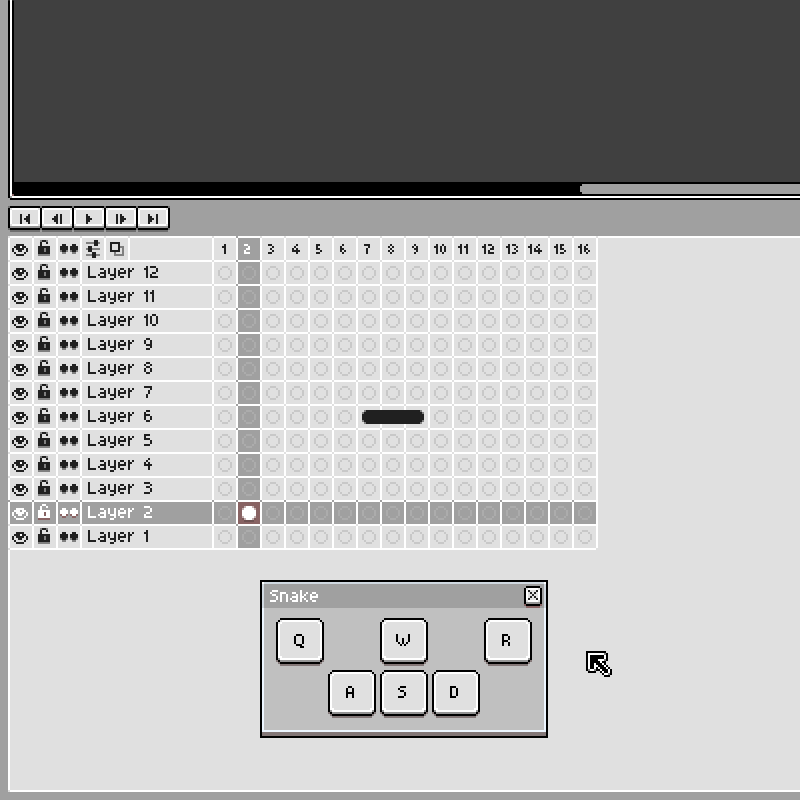

# Aseprite Experiments

A collection of various experimental Aseprite scripts.

## Timeline Snake

Implementation of the classic Snake game running on the Aseprite's timeline.

## How to use scripts in Aseprite?

1. Download a script file (*.lua)
2. Open Aseprite and go to _File_ > _Scripts_ > _Open Script Folder_
3. Copy the downloaded script file into the opened _scripts_ directory
4. Rescan the scripts directory using the _File_ > _Scripts_ > _Rescan Scripts Folder_